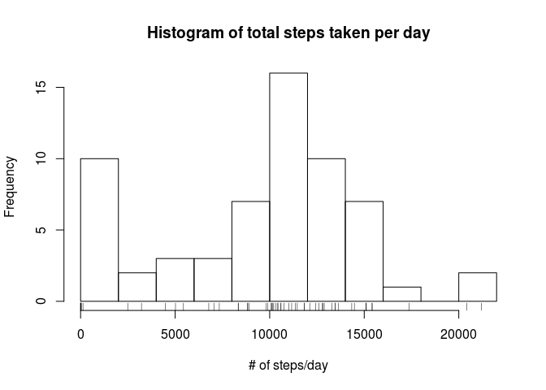
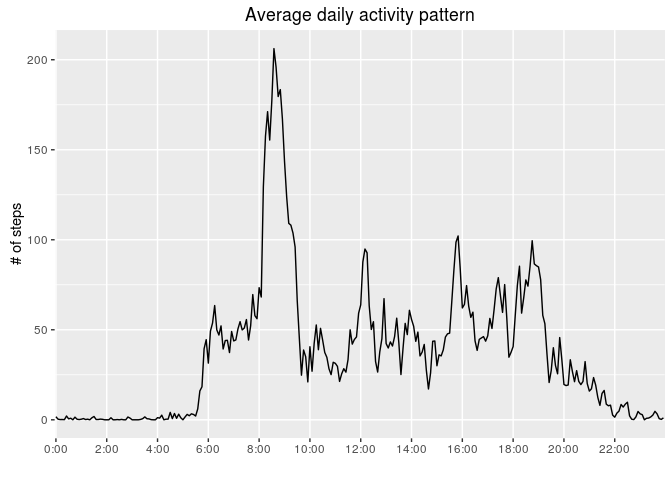
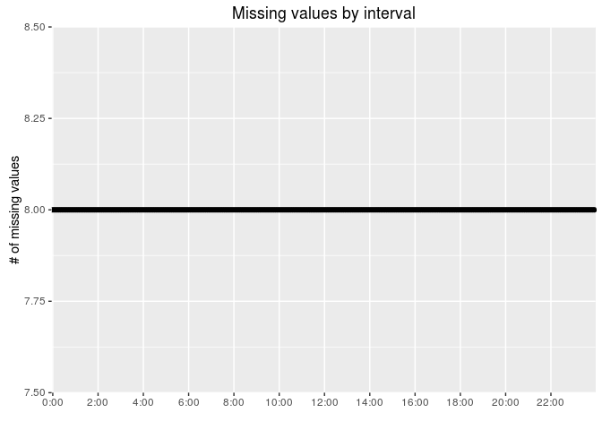
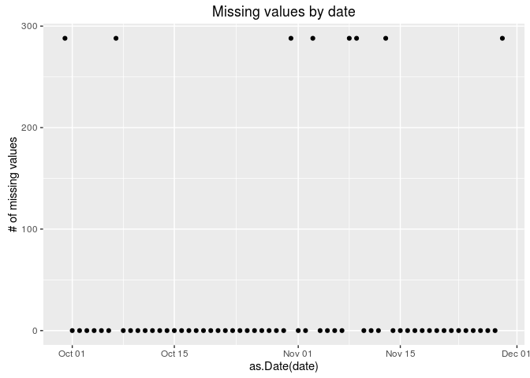
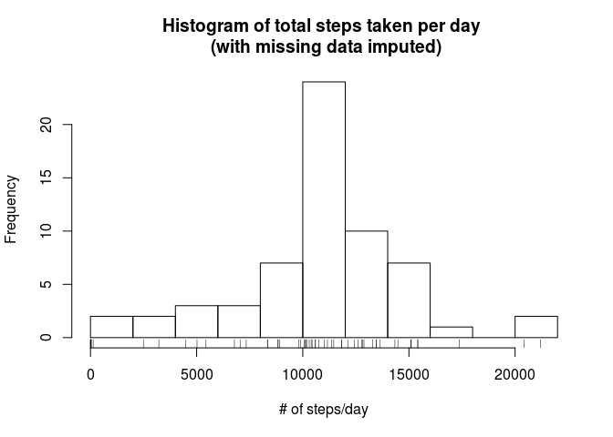
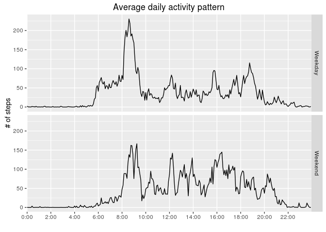

# Reproducible Research: Peer Assessment 1


## Loading and preprocessing the data

The data is found in a file called `activity.csv` within a zip file called `activity.zip` which can be downloaded [here][1] if necessary, but it should already be found locally.  To load the data it will first be unzipped into a temporary directory and then loaded into R using the `read.csv()` function (the function `file.path()` is used to ensure this will work on different systems).

```r
temp <- tempdir()
unzip("activity.zip", exdir = temp)
activity <- read.csv(file.path(temp, "activity.csv"))
```
Before we start our analysis, we'll do a little pre-processing: (1) turn interval into a factor variable, and (2) convert the date variable into a POSIXct variable.  This will keep our code cleaner later on when we start making some plots.

```r
library(dplyr)
activity <- activity %>%
     mutate(date = as.POSIXct(date), interval = factor(interval))
```


## What is mean total number of steps taken per day?

To answer this question we need to calculate the total number of steps per day.  We do this using the `summarize()` and `group_by()` functions from the `dplyr` package.  First we group observations from each 5-minute interval according to which date they fall under.  Then we calculate a sum of all intervals within each group (ie. day).

```r
daily <- group_by(activity, date)
dailyTotals <- summarize(daily, total = sum(steps, na.rm = TRUE))
```
Now that we have a table with the daily totals, we can plot a histogram to look at the distribution of daily totals.  We set the number of bins to 10 because only having 5 bins hides quite a bit of detail (namely that we have an abnormal number of "0" days).

```r
hist(dailyTotals$total, main = "Histogram of total steps taken per day",
     xlab = "# of steps/day", breaks = 10)
rug(dailyTotals$total)
```


The data looks left skewed with some outliers above 20,000 steps.  Additionally, there are a large number of days in the first bin.  It's possible that this could be due to days with missing data--we will come back this later.  Now let's calculate the mean and median.

```r
mean(dailyTotals$total, na.rm = TRUE)
```

```
## [1] 9354.23
```

```r
median(dailyTotals$total, na.rm = TRUE)
```

```
## [1] 10395
```
Interesting.  The mean daily total number of steps is 9354.23 and the median daily total number of steps is 10395.  We've been removing NA values though and from the histogram it appears that this might be distorting the data so we'll need to come back to this.

## What is the average daily activity pattern?
First we need to calculate the average number of steps for each 5 minute interval.  We use the same `dplyr` functions as we used earlier (`group_by()` and `summarize`) but we are now grouping by interval rather than date and we are calculating the mean of each group instead of the sum.  For now we are still ignoring missing values.

```r
interval <- group_by(activity, interval)
avg_interval <- summarize(interval, steps = mean(steps, na.rm = TRUE))
```
Now that we've calculated these averages for every interval we can plot them to see how activity varies over time each day.  We relabel the x-axis to make the times more readable.

```r
library(ggplot2)
qplot(interval, steps, data = avg_interval, geom = "line", group = 1,
      main = "Average daily activity pattern", ylab = "# of steps") +
      scale_x_discrete("", breaks = seq(0, 2400, 200),
                           labels = paste(seq(0, 24, 2), ":00", sep = ""))
```


It looks like there is, on average, a peak in activity between 8 and 9 o'clock.  Let's see which interval had the highest number of steps on average.

```r
with(avg_interval, levels(interval)[which.max(steps)])
```

```
## [1] "835"
```

## Imputing missing values
We noticed earlier that there are a lot of missing values.  Let's make two quick plots to see if there is any pattern to these missing values.

```r
na_interval <- summarize(interval, na = sum(is.na(steps)))
qplot(interval, na, data = na_interval,
      main = "Missing values by interval", ylab = "# of missing values") +
      scale_x_discrete("", breaks = seq(0, 2400, 200),
                           labels = paste(seq(0, 24, 2), ":00", sep = ""))
```



```r
na_date <- summarize(daily, na = sum(is.na(steps)))
qplot(as.Date(date), na, data = na_date, main = "Missing values by date",
      ylab = "# of missing values")
```


Aha! It appears that the user simply forgot to wear their activity tracker on 8 days.  Given this knowledge, it makes sense to use the interval averages we calculated in the last section to replace the missing values.  To keep the code cleaner, I'll first create a special function `intAvg()`, which will return the average value for any given interval.  Then I'll call this function for each row with a missing value in `$step`, inputing the value of `$interval`, and assigning the result to `$step`.


```r
intAvg <- function(x, y = avg_interval) { y$steps[match(x, y$interval)] }
activity2 <- activity
index <- is.na(activity2$steps)
activity2$steps[index] <- intAvg(activity$interval[index])
```
Now let's take a look and see how this changed the distribution of our data.  Let's recreate the histogram we made last earlier with the original data.

```r
daily2 <- group_by(activity2, date)
dailyTotals2 <- summarize(daily2, total = sum(steps, na.rm = TRUE))
hist(dailyTotals2$total, main = "Histogram of total steps taken per day \n (with missing data imputed)",
     xlab = "# of steps/day", breaks = 10)
rug(dailyTotals$total)
```


Imputing the missing data caused the strange peak in the first bin to disapear.  Now it's starting to look a lot like a left-skewed normal distribution with two outliers above 20,000.  I would also hypothosize that the step tracking app being used is encouraging the user to walk at least 10,000 steps per day given how the totals are clustering.
  
Let's see if the mean and median changed as well.

```r
library(knitr)
compare <- data.frame(Data = c("Original", "With Imputed NAs"),
                      Mean = numeric(2), Median = numeric(2))
compare[1,2] <- mean(dailyTotals$total, na.rm = TRUE)
compare[1,3] <- median(dailyTotals$total, na.rm = TRUE)
compare[2,2] <- mean(dailyTotals2$total, na.rm = TRUE)
compare[2,3] <- median(dailyTotals2$total, na.rm = TRUE)
kable(compare, format = "markdown")
```


|Data             |     Mean|   Median|
|:----------------|--------:|--------:|
|Original         |  9354.23| 10395.00|
|With Imputed NAs | 10766.19| 10766.19|
  
The mean changed by quite a bit (1411.96 steps). The median only changed by 371.19 steps.  This isn't surprising as we already know that median is a more robust measure of central tendency and is less affected by extreme values (like forgetting to collect data on 8 days!).
  
## Are there differences in activity patterns between weekdays and weekends?
One last thing we can look at is whether there are differences between activity on weekdays and weekends.  Intuitively, it seems like there should be some interesting differences.  Let's try to plot them and find out.  First we need to create a new factor variable distinguishing between weekdays and weekend days.

```r
wkday <- weekdays(activity2$date)
wkday <- ifelse(wkday %in% c("Saturday", "Sunday"), "Weekend", "Weekday")
activity2 <- mutate(activity2, weekday = factor(wkday))
```
Now we can calculate interval averages and plot activity by interval for both weekdays and weekend days.

```r
interval2 <- group_by(activity2, interval, weekday)
avg_interval2 <- summarize(interval2, steps = mean(steps, na.rm = TRUE))
qplot(interval, steps, data = avg_interval2, geom = "line", group = 1,
      facets = weekday ~ .,
      main = "Average daily activity pattern", ylab = "# of steps") +
      scale_x_discrete("", breaks = seq(0, 2400, 200),
                           labels = paste(seq(0, 24, 2), ":00", sep = ""))
```


It looks like the user is sleeping in a little longer of the weekend and not running around so much at 8:35.  The way we imputed missing values might be dampening the differences between weekdays and weekends.  If we wanted we could go back and replace the NAs appropriately with the weekday or weekend values.

[1]: https://d396qusza40orc.cloudfront.net/repdata%2Fdata%2Factivity.zip "activity data URL"
